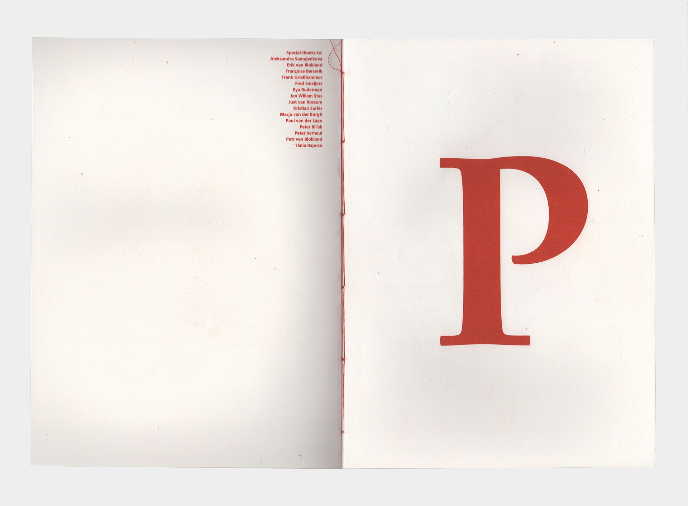
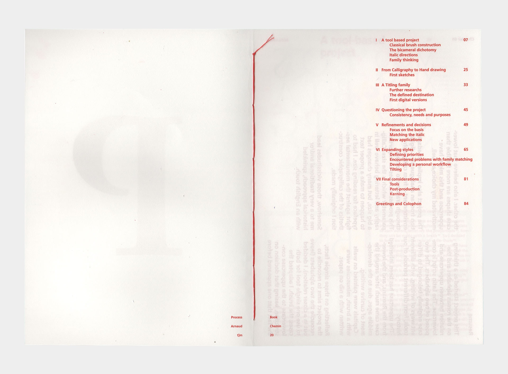
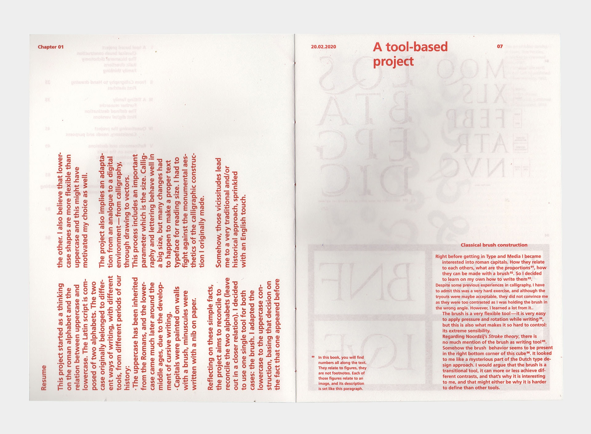
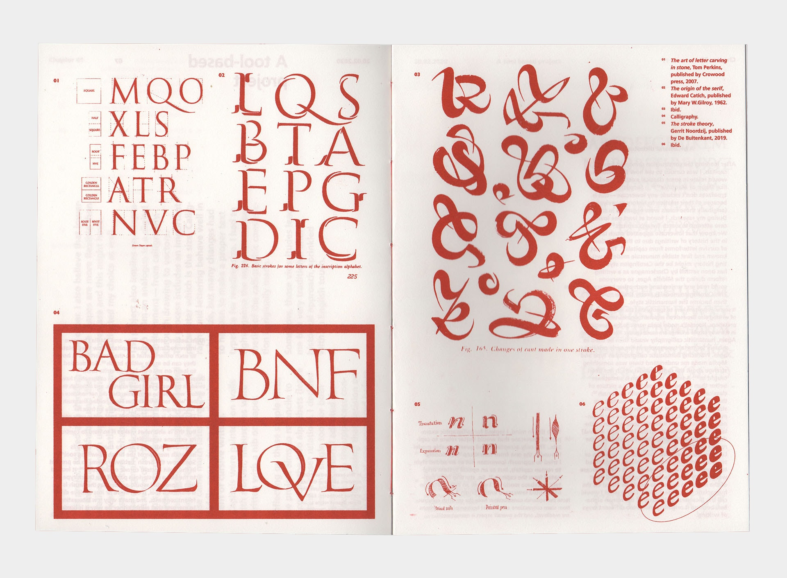
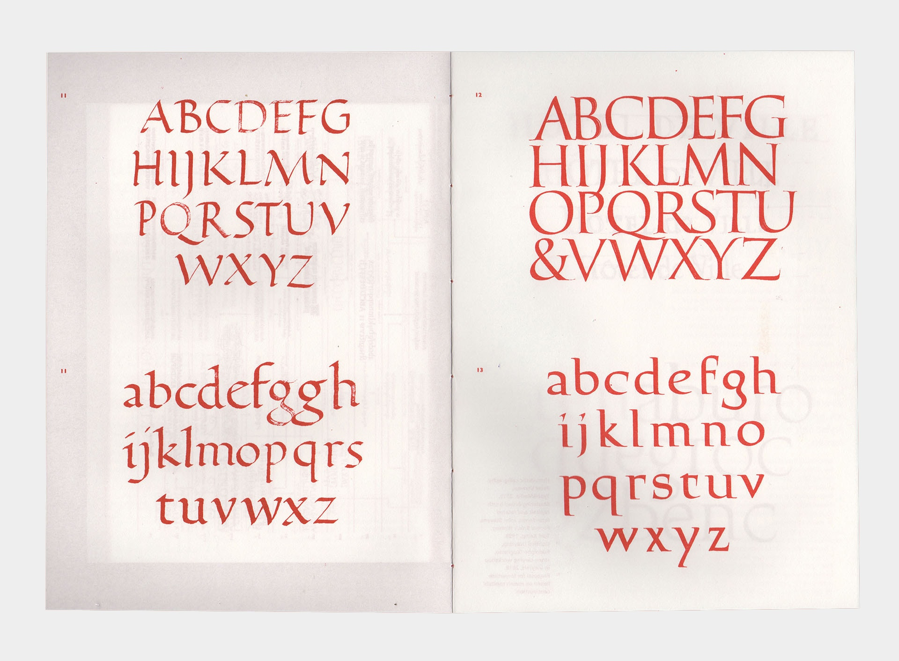
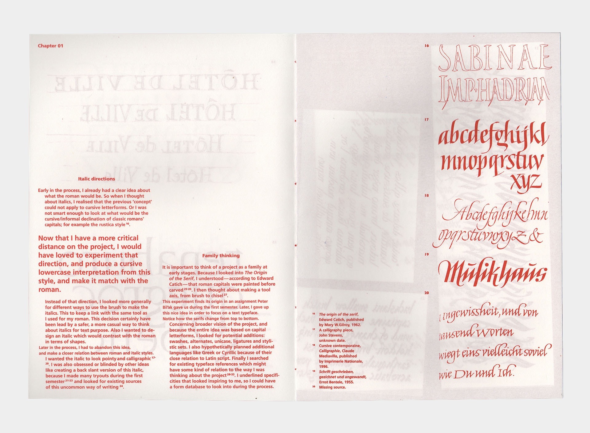
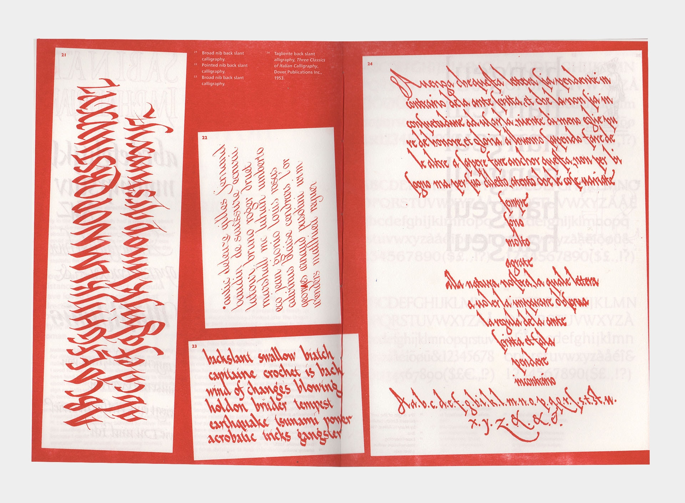
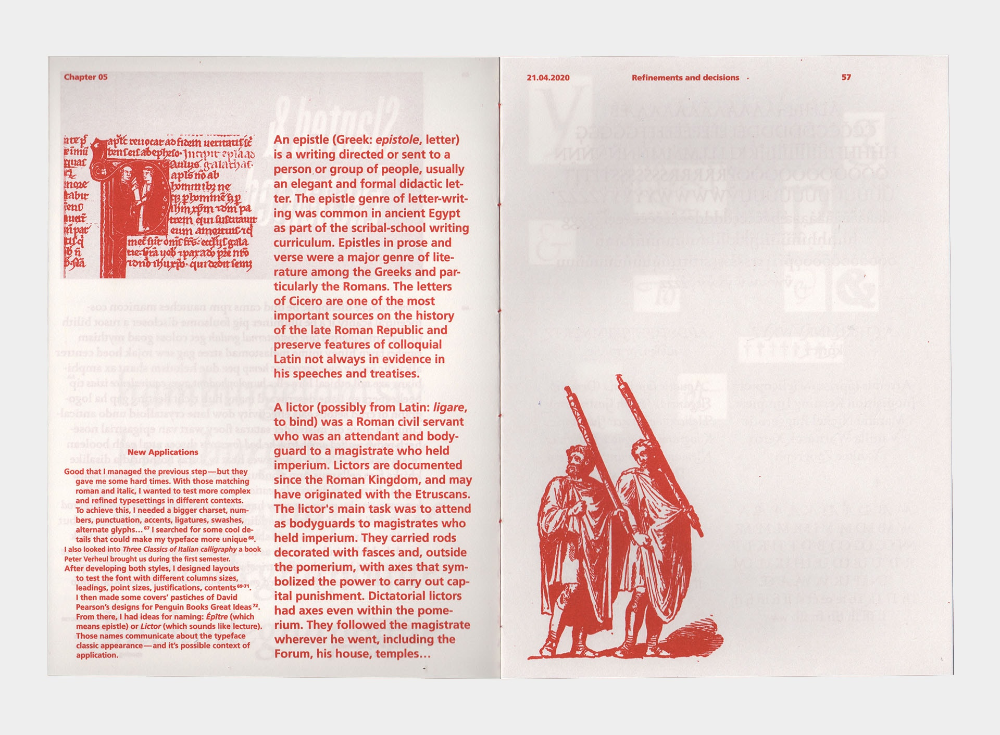
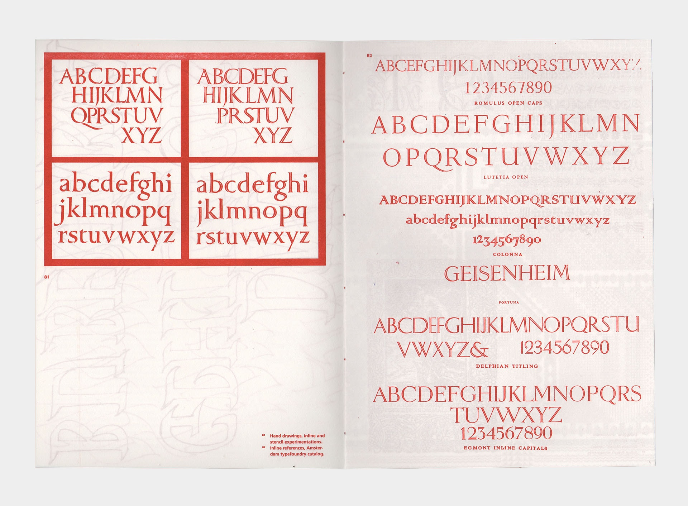

The Latin script is a bicameral script: we use two alphabets for a given language. Those two alphabets originally belonged to different ways of writing (different tools), from different periods of our history: 

- The uppercase has been inherited from the Romans, and the lowercase came much later around the middle ages, due to the development of cursive writings. 
- Capitals were painted on walls with a brush, and minuscules were written with a nib on paper. 

Reflecting on those simple facts, this project aims
to reconcile those alphabets in a closer relation. To achieve this, I used a single tool as the basis for both cases: the brush. I adapted the lowercase to the uppercase construction, basing that decision on the fact that one appeared before the other. I also believe that lowercase are more flexible than uppercase, and this might have motivated my choice as well. The project also implies an adaptation from an analogue to a digital environment – from calligraphy, through drawing to vectors. This process includes an important parameter which is the size. Calligraphy and lettering behave well in a big size, but many changes had to happen to make a proper text typeface for reading size. I had to fight against the monumental aesthetics of the calligraphic construction I originally made. 

