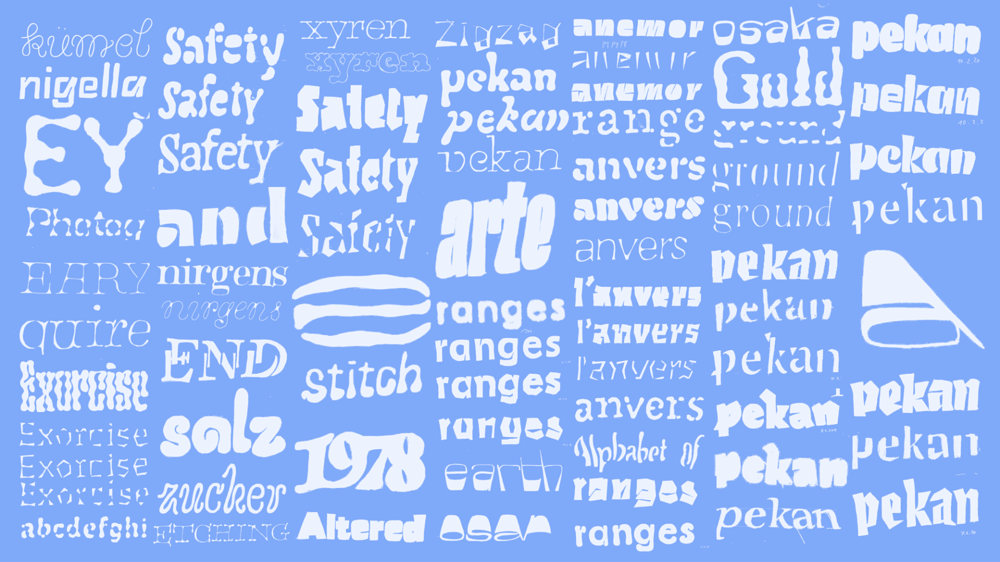
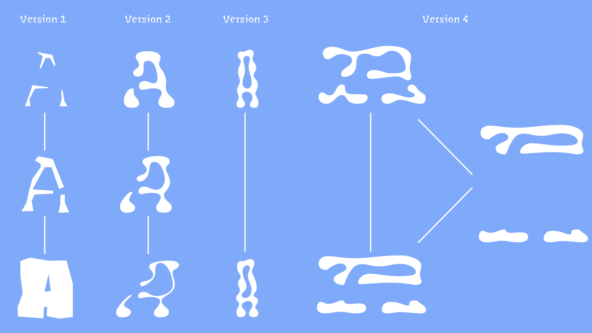

When we talk about reproductions, we presume the existence of an original. With the reproduction of an artwork, photograph, or even a book, this relation is evident. The original piece was processed to be distributed to a larger audience. I wondered how this relationship functions in the context of a typeface. Is the original version the one the type designer saves as a file? Or is it the one sold by a foundry and acquired by a customer? 

<video src="video1.mp4" controls autoplay playsinline muted loop></video>

German philosopher Walter Benjamin (1892–1940) states that an original artwork has an aura (a specific place in space and time), making it more valuable, more real than even the most accurate reproduction (Benjamin, Walter, Das Kunstwerk im Zeitalter seiner technischen Reproduzierbarkeit, Suhrkamp Verlag, 1966. p. 60.). In type design, the distinction between original and reproduction seems unnecessary. A similar value of an original artwork is only attained once the letters become part of a larger context: a precious specimen, an original drawing, a rare digital artifact, or a printed book. 
In a way, letters are drawn to inevitably be used and reproduced by others. They are tools, and therefore different from artworks. As Canadian philosopher Marshall McLuhan (1911–1980) addressed already in the 1960s (before the appearance of digital type), ‘Printing […] provided the first uniformly repeatable “commodity” the first assembly line — mass production.’(McLuhan, Marshall, The Medium is the Massage, Bantam Books, 1967. p. 50. )

<video src="video2.mp4" controls autoplay playsinline muted loop></video>  

I am fascinated by the idea that the shapes that I draw will be used by others, changing their appearance completely. As a type designer, I believe it is crucial to understand these effects as they might profoundly influence the reader. To a certain extent, it is possible to intervene in this process and to adjust the design (e.g., via the usage of ink-traps or hinting). However, it is impossible to foresee every possible condition that might alter a shape. I find this idea paradoxical and beautiful at the same time. It seems absurd that there are very accurate solutions to enhance legibility, when we do not always have complete control over the usage. I often find myself more inspired by those distortions than the most precise details. Instead of trying to prevent these errors, I am exploring ways of using them, as a source of inspiration to draw new shapes. 

<video src="video3.mp4" controls autoplay playsinline muted loop></video> 

Designing type is always an act of interpretation. As type designers, we interpret pre-existing models no matter if we are working on; a revival or a new typeface. In the context of revivals, this interpretation is self-evident. Designers frequently discuss their involvement with the source material: how closely they followed a model, or in which ways they added their *own* touch. Likewise, when designing a *new* typeface, the type designer must follow certain conventions to keep the letters legible. In a sense, interpretation works in two ways. The designer draws shapes that interpret pre-existing models, and the reader re-interprets those decisions. Letters become a visual code that transmit more information than the words they form. They point to historical events, ideologies, or trends in design. They accumulate data on their usage and context, as well as the designer’s visual preferences. 

<video src="video4.mp4" controls autoplay playsinline muted loop></video> 

Finally, there is a third type of interpretation, the interpretation of technology, and the medium on which the type is displayed. 
I explored the latter by deliberately letting different technologies interpret my drawings. In the second step I manually re-interpreted the shapes by re-drawing the results. Some of the processes I implemented are very common, such as printing, scanning or photographing. Other methods are more obscure, like scrolling through text while recording the movement on screen. Sometimes I processed the letters only once; other times, I combined multiple steps. I had some criteria for choosing the methods: Firstly, the resulting letters had to remain legible. Second, the results had to be visible, and surprise me visually. Furthermore, I was mainly focusing on methods that allowed me to work as fast as possible. I wanted to generate different degrees of distortion to inspire the behaviour of the animations of the variable fonts. By working this way, I generated a large archive of very unusual results. 

In an alphabet, each shape adds and adheres to a previously defined set of rules. As a type designer, I find this idea intriguing and usually decide on those parameters early on. The type of serifs or contrast were determined. In the next steps, I chose weight and proportions. I measured and adjusted the weight of stems and decided at what point the curves enter them. Most of these decisions are made based on conventions, personal experience. 
However, when I looked through the examples of the processed type, I noticed that all these parameters often changed per letter. 
Sometimes the initial parameters of the typeface faded out of view. I asked myself what would happen if I chose different rules for each letter. For my system, I tried to disregard the way I usually draw and to forget about coherence in contrast or serif designs. I wanted to see if I could still design a typeface if each letter functioned differently. For instance, some stems end in serifs; others flare, or even have entirely straight endings. Probably none of the stems have the same values, and the contrast is not clearly defined. For me, these terms became less important than trusting my personal judgement of consistency. 

In a way, it allows the viewer to interpret the parameters themselves. It also proves that the legibility of a typefaces does not necessarily rely purely on consistent values and the following of strict rules. 
All in all, the most valuable lesson I learned was that letters could be legible despite deviating from conventional models. It is the context in which they appear that makes them readable. It was also good to remind myself that even if I designed beautifully accurate curves, they might be processed and perceived very differently. 