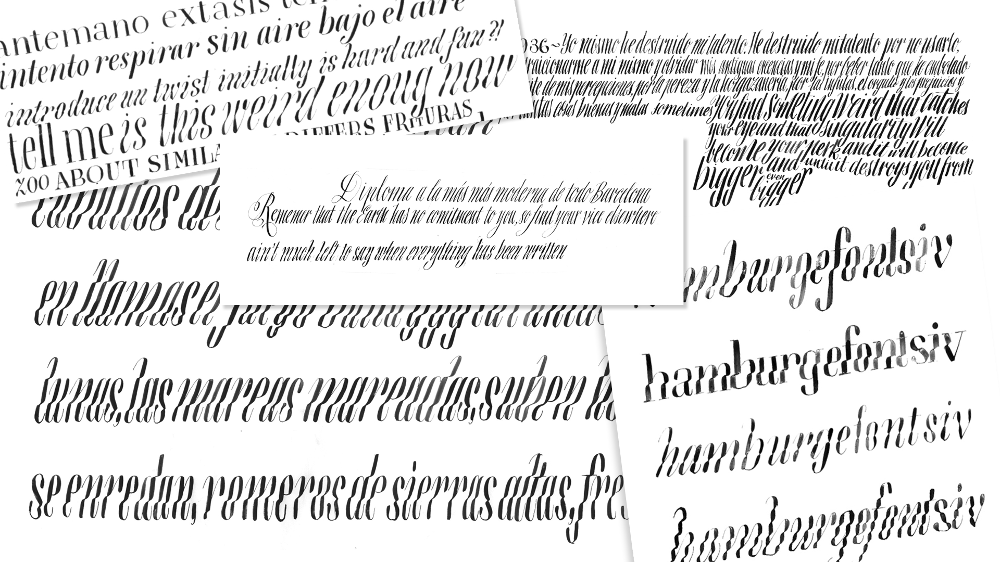
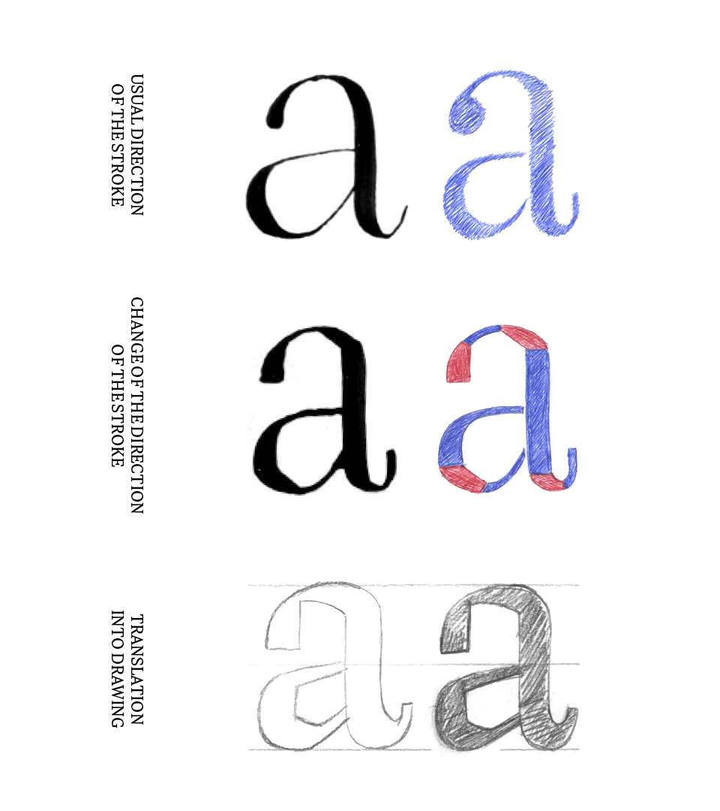
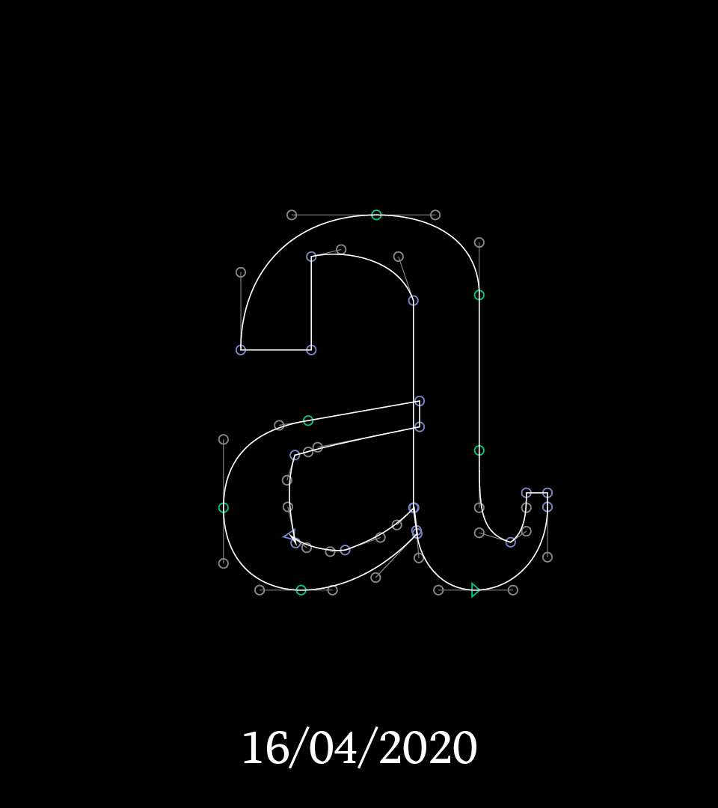
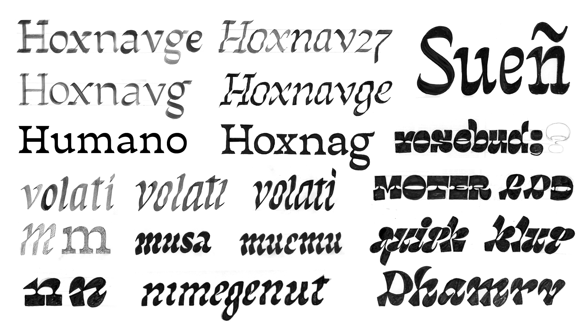
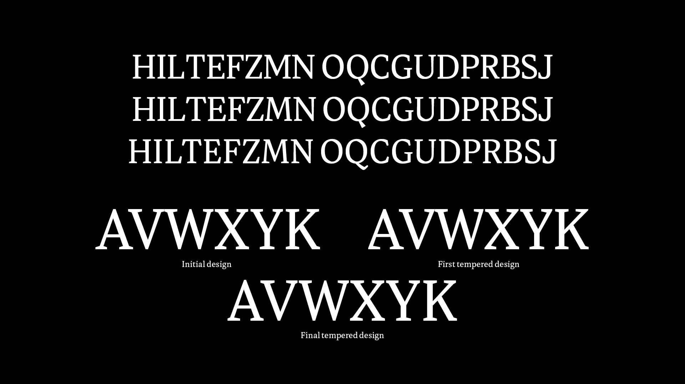
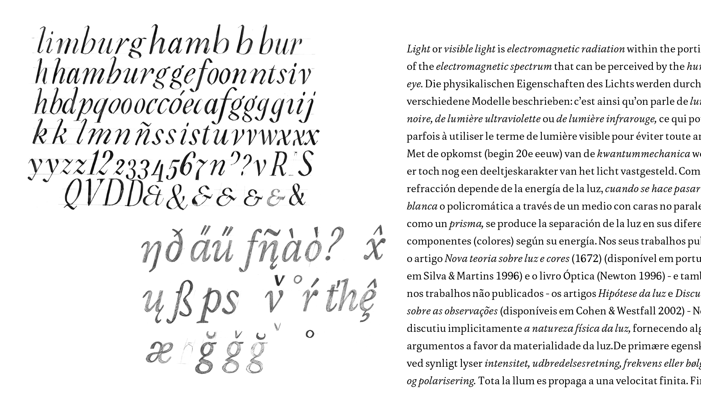
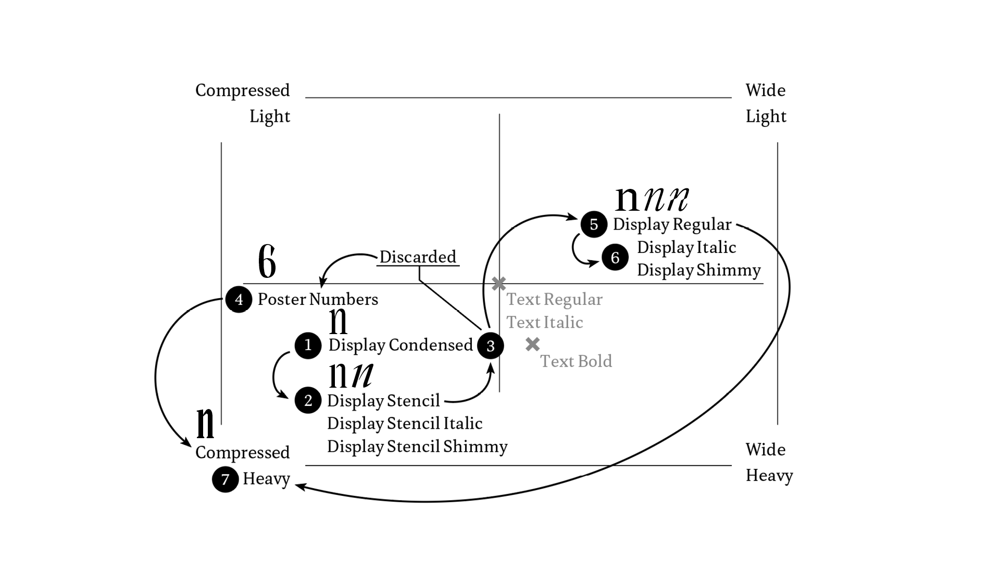

  

The project started with different experiments carried out with the expansion nib during the first semester. I explored the vertical stems in compressed styles in italic in order to create a rhythm. With this I started to question I how could break that texture and generate something else. I started to generate different approaches experimenting with the pressure and movement of the tool, shifting the focus from the vertical strokes to the horizontal ones. From these explorations, a field opened to a broader spectrum and various ways to approach it. The intention was to build a family based on the contraposition of each design in a unified way — a group of typefaces that would create very different impressions on the page while concentrating on breaking the vertical ductus. 

  
I decided to explore the potential of this idea and see how the family could grow in different ways. I tried different ways to achieve the horizontal emphasis with sketches working on different types of contrast. At the same time, I needed to consider different ways of creating relationships between such different styles in the family: from differentiating styles (based on translation contrast for text and expansion for display) to creating a skeleton to use as a base for all the different designs. With all these different outcomes, I started to make what became a series of decisions to narrow down and organise the type family, in order to focus only on one idea. I decided to build my project on one type of contrast based on its roots: expansion. 

  
The design of the display and the text were tackled simultaneously. They were like two stars: sometimes one orbited the other, sometimes it was the other way around. Sometimes each of them followed their own path and sometimes they met in the middle. It was a very dynamic and active process where the decisions made for each style had an impact on the direction of the type family.
The first steps of the text style started experimenting with shapes and readability. I tried to find different ways to generate a texture that would look similar in small sizes but from differing shapes between *Display* and *Text.* Using a rougher approach, I began to consider all the ways I could introduce breaks in the rhythm of the letters. I also began to see how to translate those *cuts* that happened in the *Display* style from a disparate point of view. I didn’t want my text to follow the design of the *Headlines* and vice versa; I wanted to achieve different voices with each style. The text style started to take shape by finding a balance in proportions and establishing a system to the design. 

  
By taking the nib and trying to draw the upright version of the original calligraphy, I started to construct a system. In a regular expansion contrast, the nib has a straight movement and the pressure starts at its lowest, it reaches its thickest on the vertical stroke, where the nib is completely open with the pressure following the direction of the stroke. For *Edonia,* I changed the direction of that stroke for the times when the tool was moving horizontally and down by increasing the amount of pressure. This caused the vertical strokes to stay the same as a regular model but changed the contours where the pressure was increasing. This created a new model with coherence that gave shape to a system. 

The next portion of the project focused on the design of the text styles in order to eliminate distractions when used at small sizes and to balance round shapes with the diagonal cuts. I concentrated on finding the compensation between how the cuts were placed and how it influenced the darkness of the text. The next challenge was to apply those diagonal cuts to the uppercase. The letters with curves contained the cut in the counter shape, but the natural motion of the tool didn’t generate those shapes in the squared and diagonal glyphs. The solution came from different historical sources which had already been applied in the *Compressed* style. To harmonize the system, I created a tempering in the thin strokes in order to change the rhythm and balance the weight. 

  
Once that design of the *Regular* text was sorted out, I started to look at ways to resolve its matching *Italic.*

Looking at the *Regular,* it became apparent that the calligraphic expansion roots of the design got diluted. The aim of the *Italic* was then to create an expansion-based design that remained close to the calligraphy which emphasised the origin of this typeface. After different approaches, I took my nib and applied the system that I had created for the roman. The outcome became a balancing act, generating a juxtaposition of diagonals and rounded shapes that would match yet contain the calligraphic origins of the family. Working with the change of the direction of the stroke in Italic was very interesting, and the design became more vibrant with the introduction of some details in the diacritics. 

The *Text Bold* was only approached like an evolution in weight from the *Regular* at the beginning, but soon enough it brought other questions along. The main question was how the cuts would behave in the counter shapes when the weight increased, so they had to become steeper. The dispersion of the weight establishes more prominent cuts in the narrow counter shapes, setting the focus on the verticality; due to its mass, it evokes squareness in the system. 

  
The *Display* style was a chance to explore the limits of the designspace. It changed dynamically with the design of the text style by testing the family in different editorial designs. This helped me realise the visual combination of the different styles in the page in order to achieve a very dynamic matching. Starting with the calligraphy made with the pointed nib, its design went from a condensed design with long joints, to an experimentation with the whiteout that became a stencil. Trying to create a contraposition of the text made me explore different values of weight and width for this style and even made me imagine a set of poster figures that resulted in becoming the main inspiration for the compressed style. It became an interesting optical challenge because the task resided in drawing the white, not the black. Evening the typographic darkness like a smudge that you spread and cover with whiteout to balance shapes made me come up with design solutions, the main one was to make serifs longer with a triangular shape to fill better the space without creating too dark terminals.

