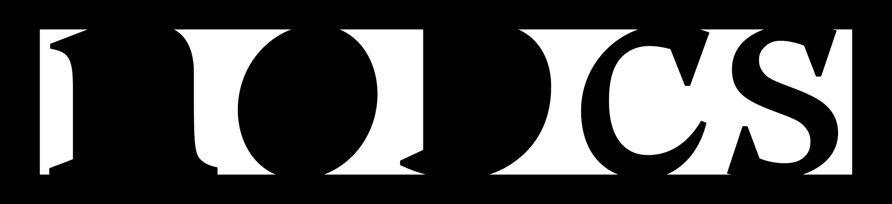
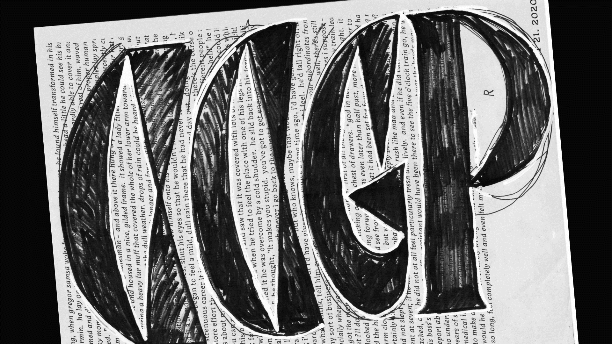

#### Intro

Coming up with an idea for my final project was an insecure path. I approached it from a few angles but in most cases it was about relating members of the family to each other. I iterated through three main phases, each of them reflected my interest in exploring family planning and links between text and display styles. Each of them had iterations by itself. Looking back I can clearly see how each stage contributed to the final result. 

#### Stage 1

In the beginning I was fascinated by writing tools and their possibilities. I liked how intuition based on previous experience can lead into better and new visual forms. Building this intuition and muscle memory was interesting to me. I tried to write as fast as possible and as precise as possible. Doing each letter was like a race, first you go to check the trail, ride slowly and by each lap you increase the speed and precision in every turn. The idea how tool, speed and other factors can influence the final result was interesting to me. As development on the headline styles was progressing, text styles were slowly getting better in the background.  

#### Stage 2

As I had a satisfactory result in the text I focused on the headline again. This time, my main focus were grafitti inspired letters written in one stroke. I soon discovered that not every letter can be done in only one stroke. This system, that worked for uppercase, was very hard to translate to lowercase. This style was creating a huge contrast to the text size and it didn’t fit at all, but that’s what I wanted, right? I was doubting my headline more and more as I eventually left it.

#### Stage 3

This one started on April 23rd, when I did a first sketch for the headline and since then I was working on it. 
The text continued to grow and develop in the background, the main focus was again put at the headline style. 
The sharpness and triangular details are a distinctive feature in the text styles, therefore I wanted to underline this in the headline style. It went through some try-outs where they related less or more each time. I think I managed to find a compromise that still allows me to experiment and is related to the text size at the same time. I knew the type is about overall texture and impression. 
But still, how should some details be translated from text into headline?

#### Conclustion

I have learnt and a lot and I discovered interests and abilities that I didn’t know about. I am happy for this exploration led by our awesome teachers that took good care of us even in unforunate times of COVID-19!
