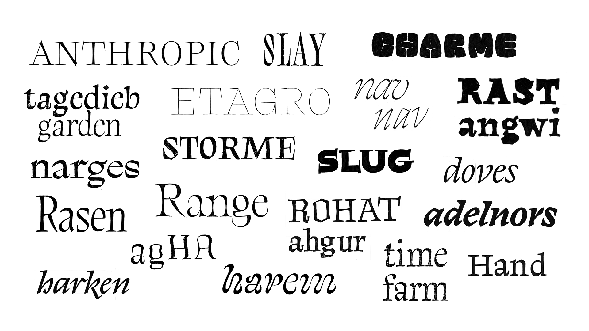
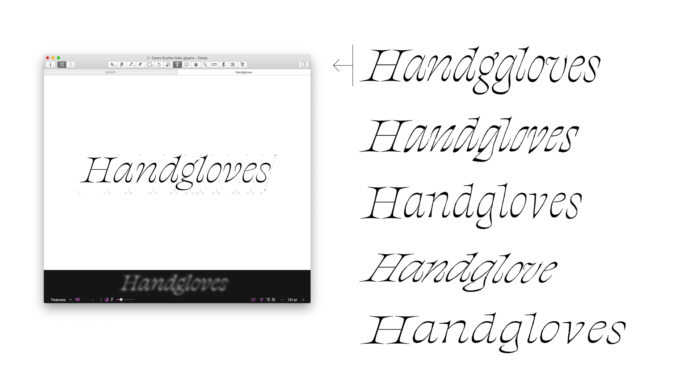
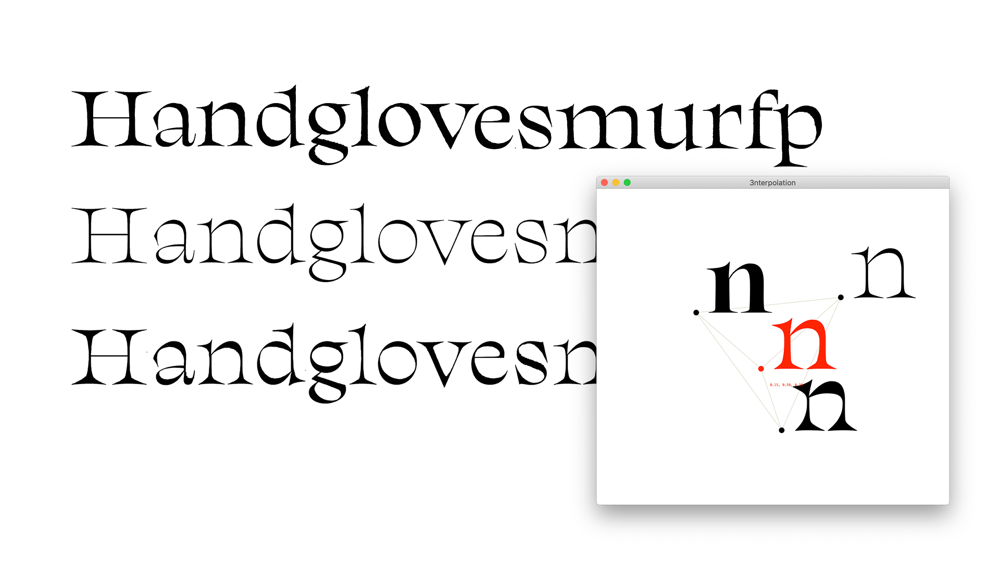
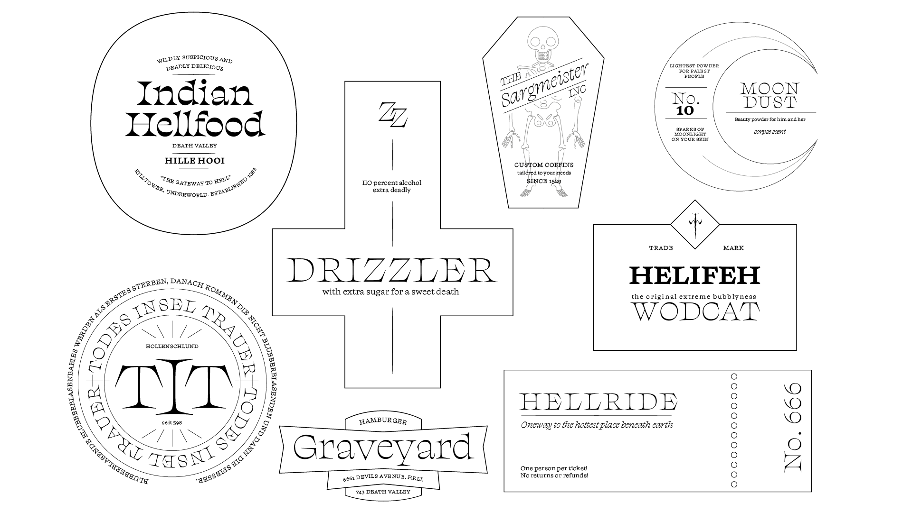

The very first thought on this project emerged when I saw the use of smallcaps to highlight the voice of *Death* in Terry Pratchett’s Discworld novels. This typographical hint sparked the idea that type can play a special role in storytelling. I grew fond of the idea to tailor a typeface to represent only the character of Death.

I thought of some characteristics that are apparent for the character and made a TypeCooker recipe based on adjectives: *stiff, daunting, bone-like, strong, morbid* and *peculiar.* With these characteristics, I sketched as many different designs as possible.

    

I noticed a preference for light weights and realised that I needed to focus on the sharpness of the drawings. The serifs needed to be pointy to create a dangerous and uncomfortable looking typeface. I started to digitise and experimented with different serif treatments. The culmination of weight in the *Light* style was an interesting feature that I wanted to explore further. With bracketed serifs I could put even more weight on these joints which resulted in a rather organic looking texture.

    

Designing a corresponding text version was rather difficult. I wanted to keep the sharpness of the *Display* design, and optimise it for reading sizes. But I was never really satisfied with how the styles worked together. Therefore I wanted to explore some other possible styles: an *Italic* and a *Bold* for the *Display* style and an *Optical Size.*

Designing the *Italic* came to me quite easily. I made several different drafts and soon decided on a playful version with twisted stroke endings. 

    

The *Bold* style was much more challenging. How would the weight behave? Would it have reversed contrast, or would it gain weight in the stems? I tried both options and experimented with a three-master-interpolation to see how the weight inbetween behaves.

    

For the *Optical Size* I interpolated the display with a sketch that was designed with more weight and less contrast. Then I also created a bold master for this *Optical Size* to explore what a regular weight could look like.

There were so many possible styles to explore, but I knew that I would not be able to finish all of them for my final project, so I had to make a choice. I decided to take a step back and have a critical look on which styles are most useful. For this purpose I did a small experimental layout to see the potential of my styles.

    

I already knew that I wanted to continue to work on the *Display Roman* and the *Italic.* But this test also showed me that the *Optical Size* worked well together with the *Display* styles.

At first the design of the *Optical Size* had an irregular rhythm, because the weight was not consistent throughout all glyphs, especially in the bolder weights. This was also due to the reversed contrast model. Therefore I decided to make the *Bold* and *Regular* more upright and to have an increase in angle from *Light* to *Bold.* I also adjusted the proportions to have longer ascenders and decenders and a larger cap-height in order to improve reading quality.

    

After refining all styles, I noticed that they do not fit in the Display/Optical Size model that I originally thought of. Therefore it seemed to be suitable to think of more abstract terms to describe their purposes. I finally decided to group them into *Scythe* and *Sickle,* not only because the terms are an abstract metaphor for large and small, but also because they fit the theme.