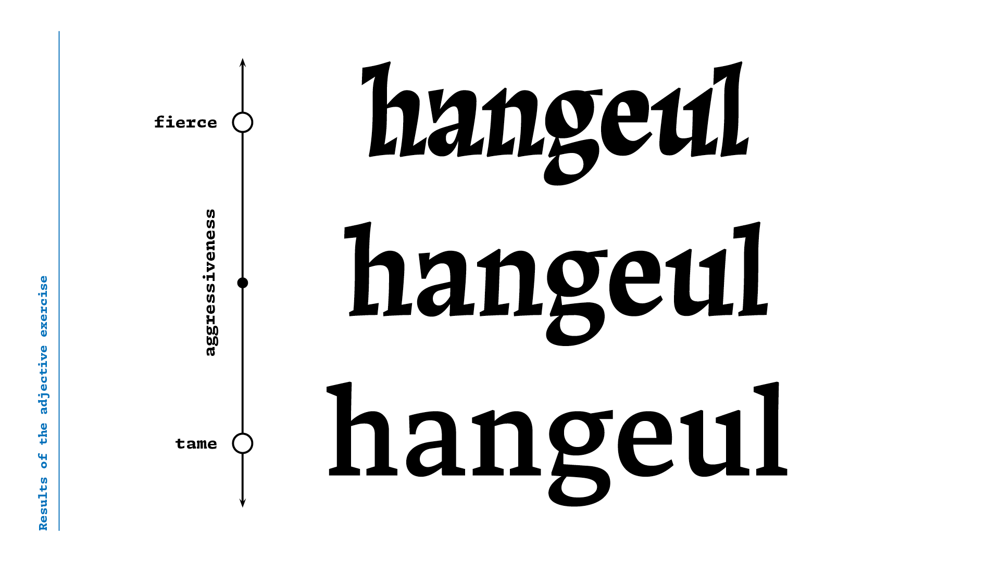
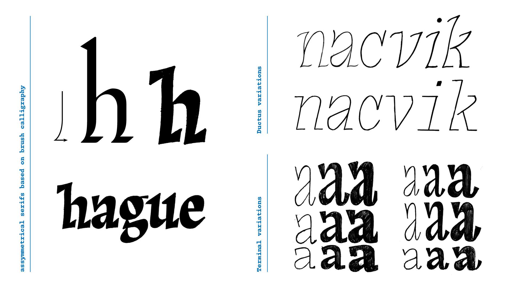
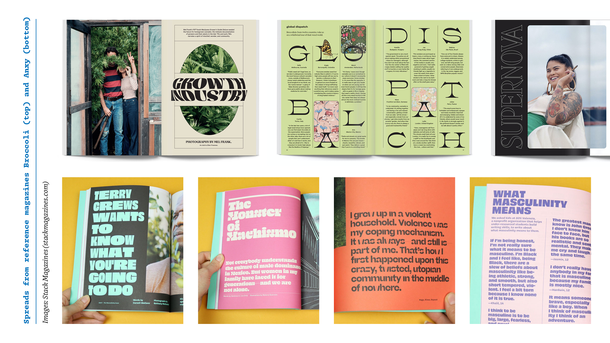
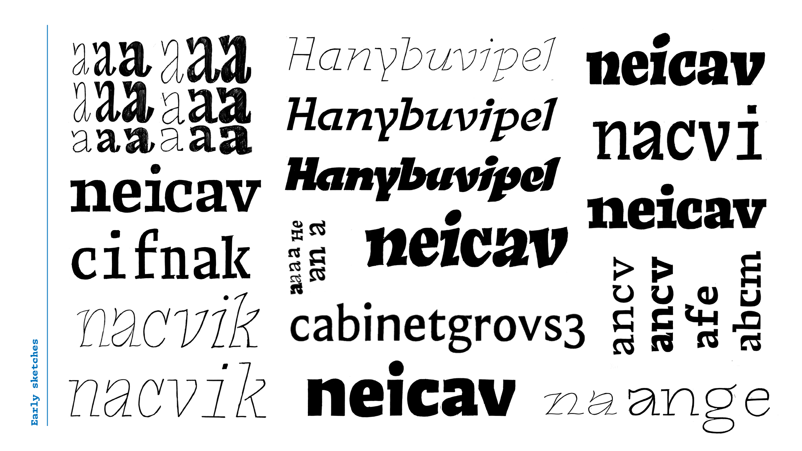
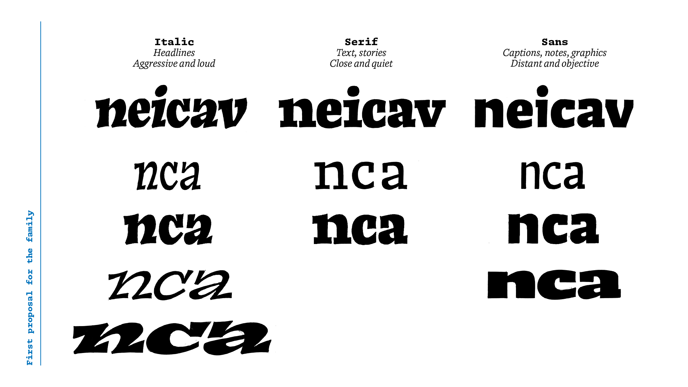
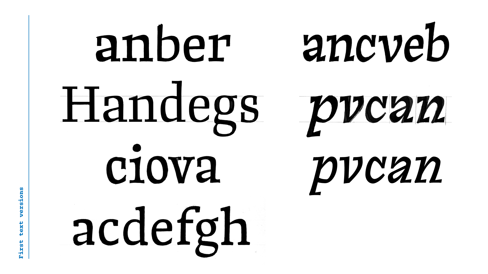
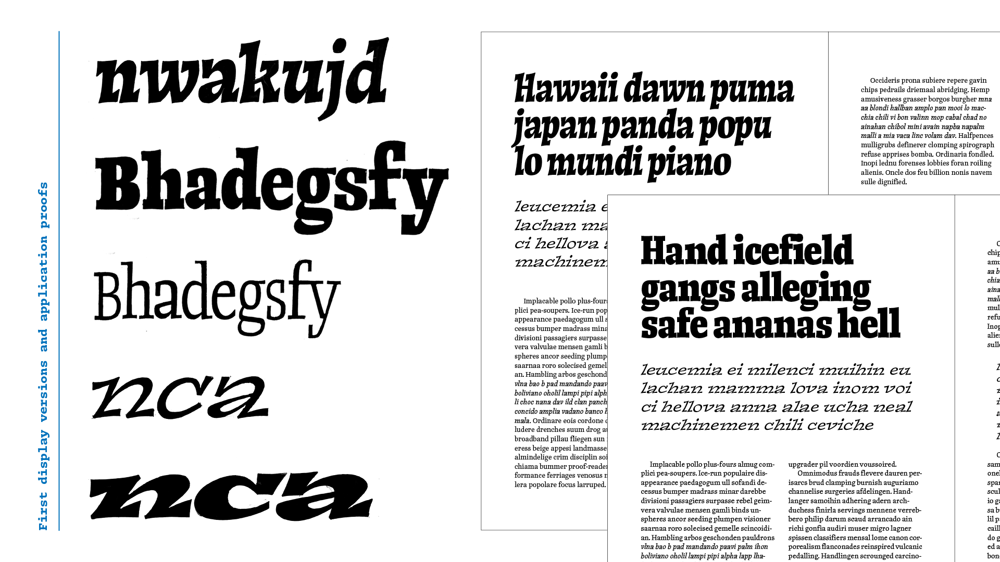
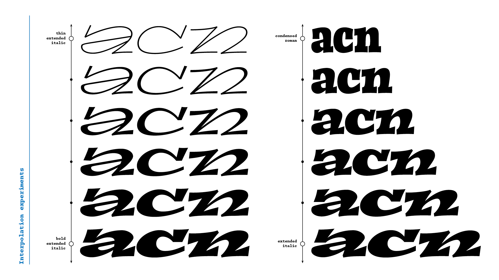
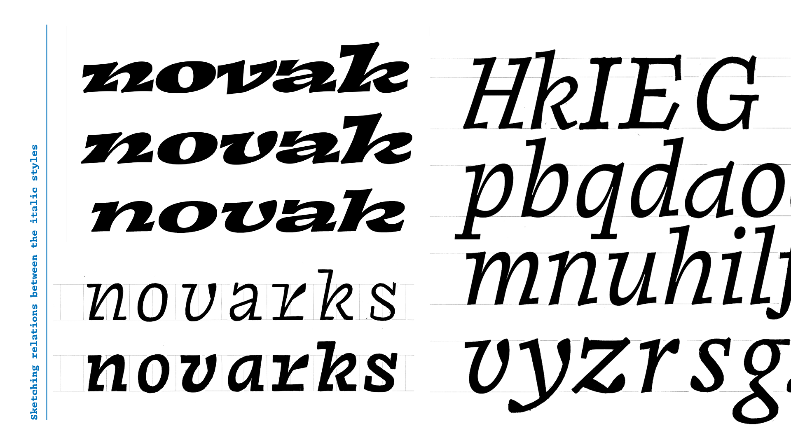
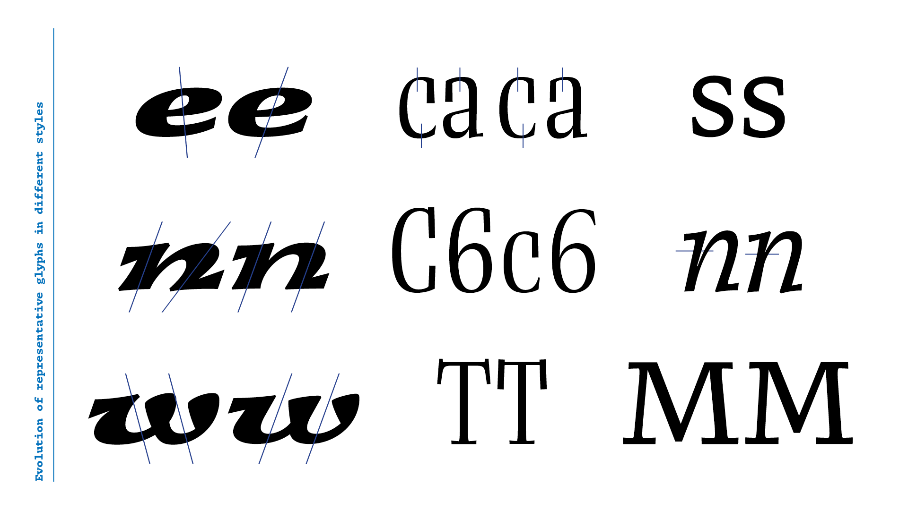

The catalyst of Diafone was an assignment from Peter Bilak which consisted of designing one word in two interpolatable styles, based on an adjective and its antonym. The adjective I chose was *fierce,* for which I drew a slanted roman with heavy asymmetrical serifs. For the opposite extreme, *tame,* I drew something inoffensive; a sturdy and straightforward text style.
​
    
​
The result of this exercise sparked my interest for two ideas that became pillars of the concept of *Diafone.* Firstly, the slanted roman construction and the explorations of terminals and ductus within this style.
​
    
​
Then was the concept of building a family around an adjective axis rather than the more traditional way of organizing styles according to weight and width. I wanted to find a place between the two extremes exemplified here by Adrian Frutiger’s Univers — in which all styles are cohesive and have the same voice — and Nikola Djurek and Marko Hrastovec’s Audree — a toolbox for designers to tailor a style that suits perfectly one specific application. My goal was a typeface with different styles that would work together in a page of text, but offer the designer options for different roles and tones of voice.
From the beginning, I wanted to design for the environment in which the typeface would be used. Working in this way would enable me to make decisions more objectively and define a more interesting and useful scope for the project. The choice of magazines as the application, came from my personal background. I worked in that field for some years and also have collected independent magazines for a while. So, this was a context I’ve always wanted to design for, and this felt like the best opportunity.
​
    
​
At the start I wondered if designing for a medium I knew would prevent me from experimenting more innocently. At the same time, though, it would allow me to respond to the needs I knew I would need as an editorial designer. This proximity to the final user would allow me to make choices much more efficiently.
​
    
​
I went back to sketching to translate all the concepts into a system that would guide my design process for the rest of the semester. For the kickoff presentation I had a basic structure of a design space to organize my ideas, with three main style groups:

- a louder one for headlines, following the slanted construction, with width and weight variations;
- a quieter and less expressive serif style for small sizes and longer stories;
- and a sans-serif for captions, footers, etc., with a more neutral tone of voice.
​

    
​
After the kickoff presentation, I was happy to find an exciting concept to start working on. Even though the ideas were still vague. With this structure defined, it was time to start testing and drawing variations on my first sketches, for both text and display.
​
    
​
For the text style, I didn’t want it to appear like a watered down version of the display. It instead needed to set the basic tone for all the other styles, even if in a less than obvious way. As the text style would be the one people spend the most time reading.
On the display side, I wanted to experiment with the extremes of the weight and width axes of the design space I proposed. After drawing and testing them on simple editorial layouts, I identified which designs worked better, and could determine how to achieve the most interesting set of display styles.
​
    
​
The italic styles worked better in the extended widths, with more space for the heavy asymmetrical serifs. The upright styles, on the other hand, fit better the condensed side of the design space; forming tight blocky headlines so characteristic to magazines. Since I wanted to explore different voices for the display styles, I separated them instead of looking for a middle ground. The result was a dynamic italic and a more balanced roman; each one occupying its own space.
​
    
​
Simultaneous to drawing type, I also designed more realistic and complex layouts to test the typeface more thoroughly. These application tests were very important as they helped me to identify characteristics that would guide the development of Diafone.
One example is the introduction of cursive elements in the display italic. The first versions had a very repetitive rhythm with the heavy serifs in almost all letters. By removing some of the base serifs and introducing some rounded terminals, I was able to achieve a more balanced and varied texture. These solutions were also applied into the text italic. Which works as a bridge between the more conventional text roman and the dynamic italic display style.
​
    
​
Besides text and display, I also tackled the third style group of the family, originally a sans-serif, an italic monospaced style. I was eager to see how the design would translate into a low-contrast environment, and also had the idea of drawing a monospace typeface in the back of my head. I combined these ideas into a more mechanical, monospaced version of the italics, which I found quite exciting. I also drew a bold upright version of which I later deemed to be more beneficial to the final product.
Out of the multiple styles I had partially designed towards the end of the project, I chose to complete 5 of them, saving the others for further development after Type and Media. This small but comprehensive set fulfills all the basic needs of a publication: footers and captions, body copy and finally smaller and larger headlines. They complement each other and share the same DNA, but are able to convey very different voices and personalities.
​
    
​
Ultimately, the decision of working on contrasting style groups was very beneficial as a learning experience, since each of the styles presented me with specific challenges and taught me different lessons. I’m looking forward to getting back to working on the unfinished styles for more interesting discoveries and an even more comprehensive family for *Diafone.*